# Docker  
## ARQUITECTURA  CON DIAGRAMA DE BLOQUES

1 ,2 y 3.La virtualizacion consiste en contar con computador se instala un sistema operativo  el cual ejecuta las aplicaciones de la siguiente manera como lo vamos haber en los siguientes diagrama de bloques.

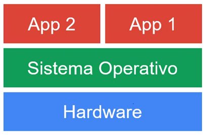

la virtalizacion utiliza la funcionalidad del hardware o también  la capa de software llamada hipervisor.

Las cuales puede contener varias maquinas virtuales

El objetivo de este lo que hace es dividir el hardware y el software  en varias cargas de trabajo en contenedores y maqina virtuales en que se puede ejecutar aplicaciones.

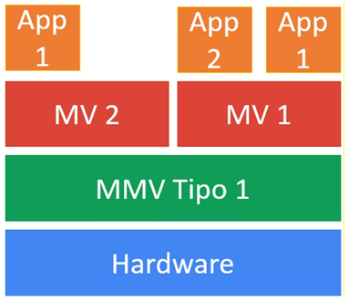

Ademas con este se puede tener el cuenta los contenedores que empaqueta  una aplicación,esta estructura de contenedores  contiene la de pendencia y servicios del sistema operativo,es una virtualizacion adicional 

Diferencia de virtualizacion y los contenedores

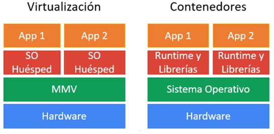

Se puede ejecuta un contenedor que active el kernel y hasta se pueda mover el contener entre maquinas que tengan el mismo kernel,ya que tiene proceso aislados solo tiene que tener recursos  como la cpu,memoria ,la red que  pongan en funcionamiento este proceso.

Estos se ejecutan en un entorno aislado,por tanto son livianos y el proceso de encendido y apagado  rápidamente.la diferencia entre un contenedor y la maquina virtual  es la ubicación de la capa de virtualizacion y la forma que se utilizan  los recursos en el sistema operativo.y aunque son diferentes tecnología cumple el mismo fin  se diferencia  en que tiene características y compensaciones únicas para las cargas de trabajo.
En el mercado se consiguen varios con diferencias técnicas,por el ejemplo

El docker es una plataforma muy reconocida,este permite agregar y almacenar  una aplicación  y sus dependencias en el paquete llamado imagen. Con esta se puede realizar una instancia de su aplicación.

Rkt: este es otro docker pero  implementado para la seguridad
Lxc: esta permite ofrecer contenedores de sistema completo.
 

Entre otros,como Windows que también tiene la función de contenedores

Esta el contenedor Windows es igual a docker comparte el kernel.
 Por ultimo el contenedor Hiper-V  son maquinas optimizadas  que contienen una copia del kernel de Windows,en este cada contenedor tiene su propio kernel

# 4
## FLUJO DE TRABAJO PARA PODER DESPLEGAR APLICACIONES EN DOCKER
 
El flujo de trabajo se centra en el bucle interno  y es desarrollado por el equipo de trabajo

Una aplicación tiene su propios servicios asi como bibliotecas, para poder luego ejecutar la aplicación docker como se puede apreciar en la siguiente figura.

  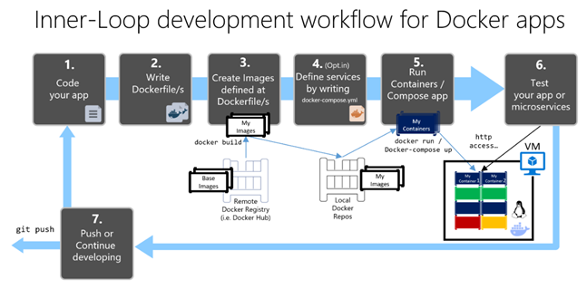

Flujo de trabajo de bucle interno para el desarrollo de  la aplicaciones de contenedor docker

Para estos se tiene encuentra la aplicación visual studio code 2022,que puede ayudar a controlar  los pasos de forma automática.
Para eso debemos dar click en dockerfile y en el archivo docker.compose.yml a los proyectos de la configuración de la aplicación,con este se compila aplicación de docker  y se puede trabajar con varios contenedores y aumento  la rapidez de desarrollo
 También es importante saber que hace docker en segundo plano,por consiguiente veremos los siguientes pasos en este  workflow:

Paso 1: empezando a programar
La creación de un aplicación en docker es igual cuando se realiza una aplicación normal,solo que los servicios se ejecutarían en el docker  en un entorno local que puede ser una maquina virtual Linux o en el contenedor de Windows
Para esto se debe hacer una Selección de la carga de trabajo Desarrollo web y ASP.NET durante la instalación de Visual Studio 2022,pero antes se debe hacer una prueba de funcionalidade del  docker

Paso 2:
Creación de dockerfile con una imagen
 En esta parte se necesita un docker file  para cada imagen de base existente de .NET  indispensable para cada servicio,para esto se debe habilitar la compatibilidad con docker

Paso 3: creación personalizada de imagen docker  e insetar la aplicación o servicios.
Se debe insertar imagen  e implementar en el contenedor docker mediante la CLI  de docker o docker file,utilizando el comando de docker build
 Se puede visualizar todas las imágenes de docker montadas con el comando docker images

Paso 4: definir los servicios en docker-compose.ylm al compilar una aplicación en varios contenedores

El docker compose permite  definir los conjuntos de servicios y las relaciones de dependencia y la configuracion de ejecución,este contiene los datos de configuración para cada contenedor

Paso 5: ejecutar y compilar la aplicación
Se ejecuta el contenedor mediante el host local del docker,aunque si tiene varios servicios se puede implementar de forma compuesta medienate al comando  CLI  docker –compose –up o con visual studio 

# 5

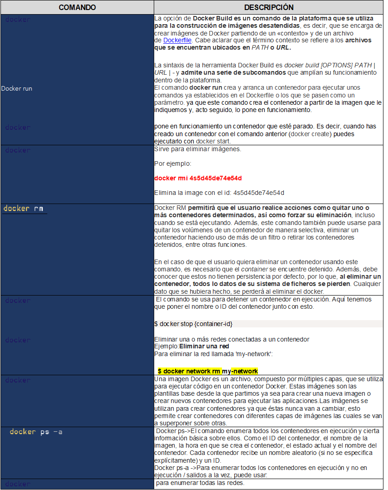

# 6

Prerrequisitos
Antes de instalar el back-end de Docker Desktop WSL 2, debe completar los pasos siguientes:
1.	Instale Windows 10, versión 1903 o superior o Windows 11.
2.	Habilite la característica WSL 2 en Windows. Para obtener instrucciones detalladas, consulte la documentación de Microsoft.
3.	Descargue e instale el paquete de actualización del kernel de Linux

7, 8  y 9
# INSTALACION DE DOCKER
 
 Descargar  el instalador de docker desktop para Windows 10

 

 Dejar las dos pestañas y  darle en ok

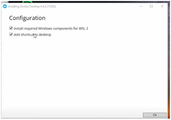

 Descargando los paquetes necesarios para instalar en nuestro sistema

 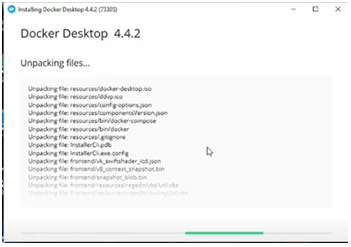

Cerrar y reiniciar

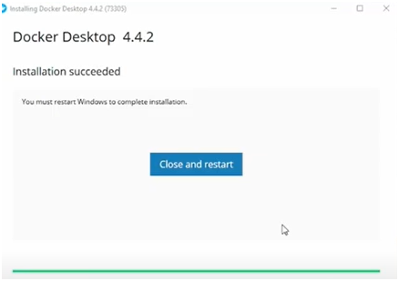

Esta ventana emergente  salen el siguiente link de color azul en donde contendrá los siguientes pasos a seguir
Por que nosotros al estar en Windows debemos configurar el kernel de Linux para poder trabajar sobre esa virtualizacion

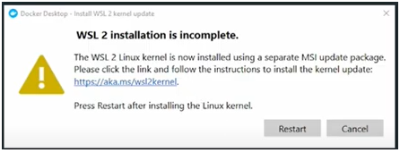

Este es el link para poder realizar el paso 4 donde se descarga el paquete de kernel linux 

Pasos de instalación manual para versiones anteriores de WSL | Microsoft Docs
* [pagina de descarga de kernel][1_0]

[1_0]:https://docs.microsoft.com/en-us/windows/wsl/install-manual

Paso 4: Descarga del paquete de actualización del kernel de Linux
Descargue la versión más reciente:
•	Paquete de actualización del kernel de Linux en WSL 2 para máquinas x64 

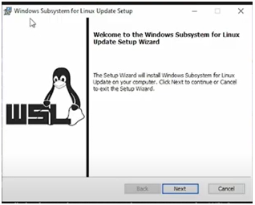

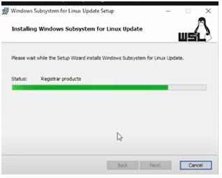

Luego  abrimos Windows power Shell
Este comando se ejecuta para establecer a wsl 2 como  versión predeterminada

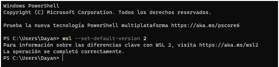

Luego podemos instalar una versión Linux de Ubuntu,pero en el primer laboratorio 1 de wls2 ya se instalo, en donde se loguea y se inicia sesión  y pues los demás  pasos en la pagina web ,no son necesarios de implementar por que estan deacuerdo a la distribución  de Linux que que  descargamos, en este caso seria Ubuntu 20.04
Se instala docker  dándole en el botón restart

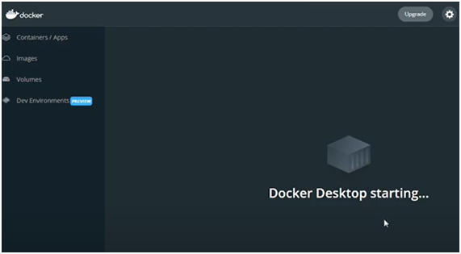

En este se encuentra un primer comando por que no tenemos ningún contenedor que se inicialice

Entonces como ya se instalo,  para poder ejecutarlo podemos abrir powershell
Damos el siguiente comando: docker
Donde saldrán los siguientes comandos y los investigados en el cuadro anterior

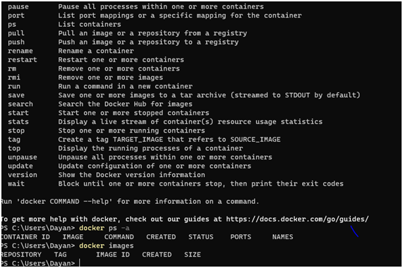

Como podemos observar al principio como no tenemos nada en el contenedor, no sale ninguna imagen al poner el comando docker ps –a, pero después que ponemos el comando  sugerido por docker ,podemos mirar que sale en la parte de imágenes…con docker images
Y se puede visualizar el contenerdor

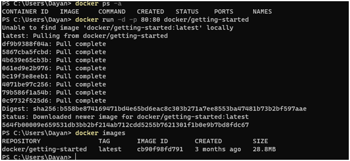

Y sabemos que corre al poner en la barra de navegación localhost:80…donde sale una pagina de docker que es la siguiente

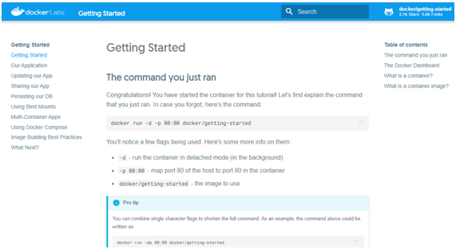

Luego nos dirigimos a docker hub para poder  ejecutar este comando
Docker pull hello-world,el cual nos dice que esta corriendo normalmente

por lo tanto aqui se ejecuta y se envia el siguiente mensaje

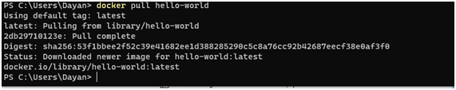

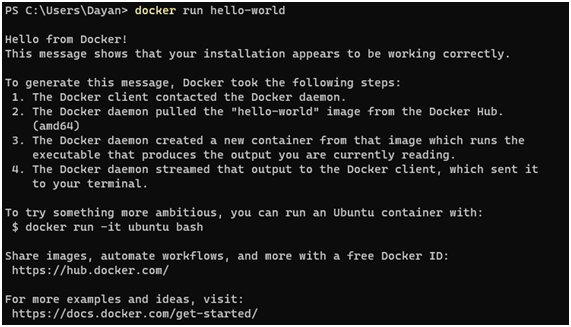

Al traducir podemos darnos cuenta, que nos explica el proceso de comunicación  que tiene internamente el docker 

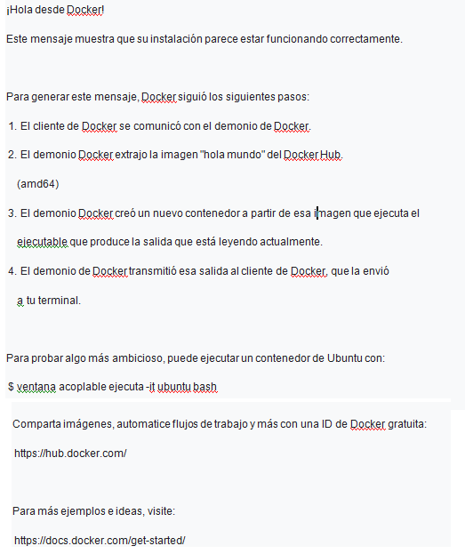

acontinuacion tenemos otros ejemplos  de instalación de imagenes
docker pull postgres

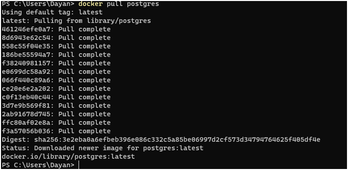

docker pull python

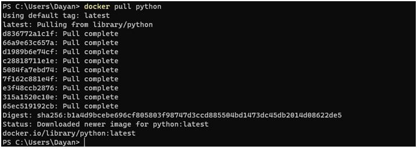

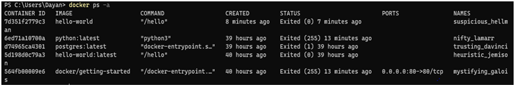

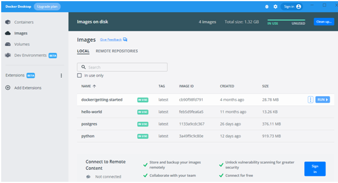

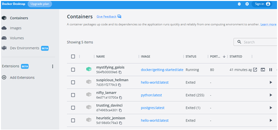

# 10.
luego de instalar docker en Windows podemos poner el siguiente comando  en powershell,para podemos descargar la versión de nuestro docker compose

docker-compose  --version 

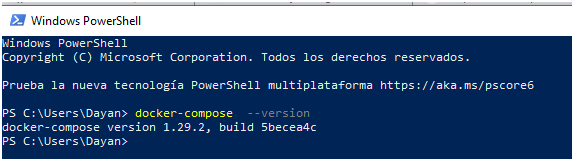

Poner docker-compose nos da los comando para poder realizar el proceso de funcionamiento

------

para instalar servicios en docker debemos tener encuenta las siguientes

para instalar pgadmin4  para poder tomar lo de las contraseña en la base de datos

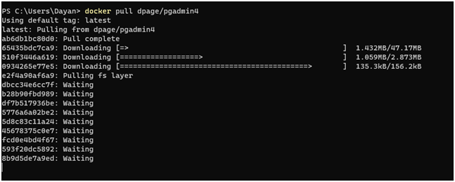

y darle a esta pagina de dockerhub 

* [comando de pgadmin][1_1]

[1_1]:https://hub.docker.com/r/dpage/pgadmin4/ 

 aquí esta el comando a copiar 

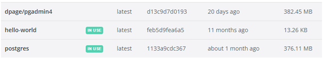

docker compose en visual studio code

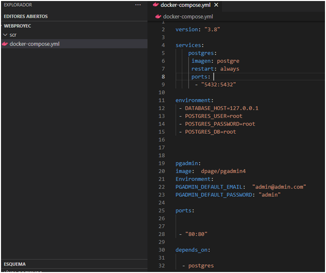

 pero antes hay que darle docker start  pgadmin.para que nos aparezca la parte para hacer el login en pgadmin

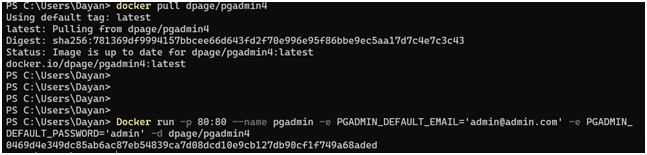

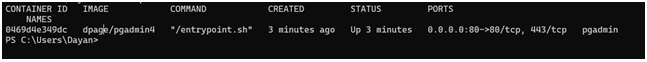

configura la contraseña  de postgres

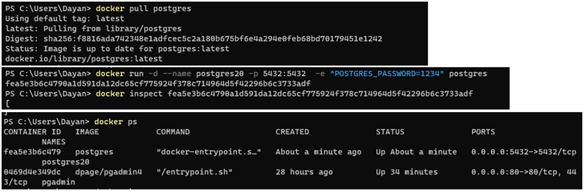

 se observa con este comando 
 * docker inspect (ID de contenedor) ejemploo:
  docker inspect fea5e3b6c4790a1d591da12dc65cf775924f378c714964d5f42296b6c3733adf
 
  permite ver el ip de contenedor de postgres

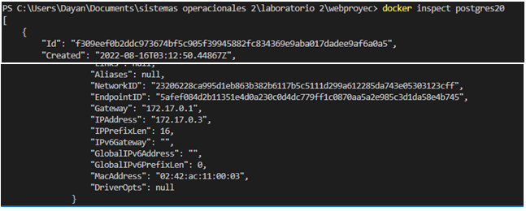

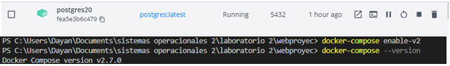!

luego  de acceder a postgres debemos crear un servidor en este caso le llamaremos docker y como usuario postgres

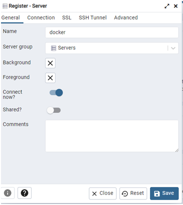

se debe de poner  la ipadress que se me mira al momento que  ejecutar el comando docker inspect

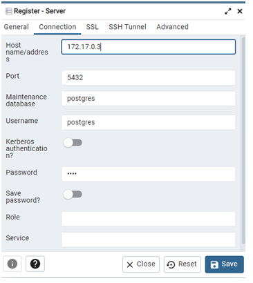

comienza a correr luego de poner la contraseña que en este caso seria  1234,como se puso al poner el comando

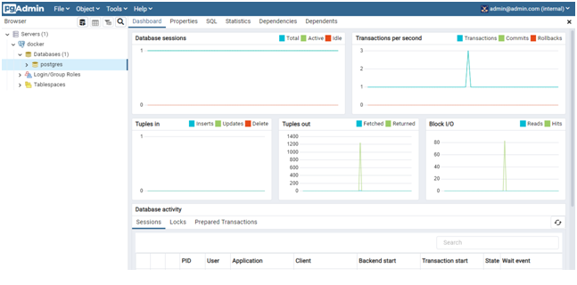

