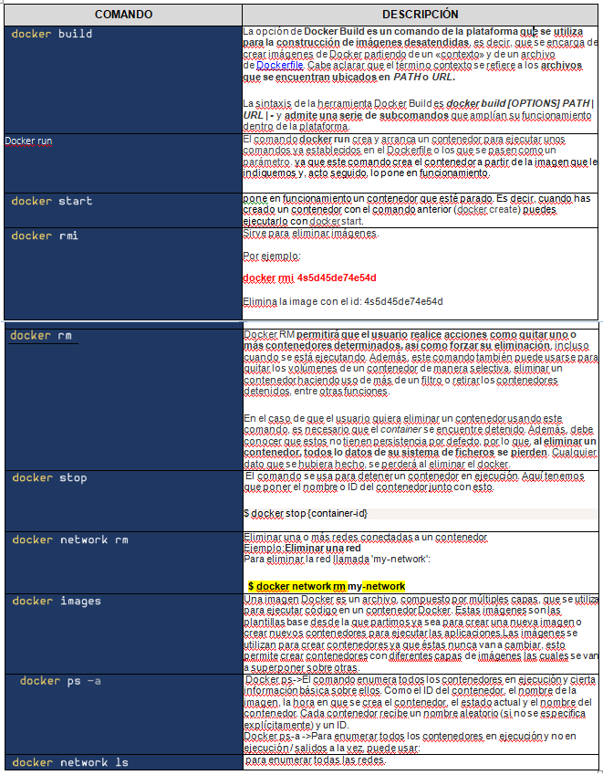

# Docker  
## ARQUITECTURA  CON DIAGRAMA DE BLOQUES

1 ,2 y 3.La virtualizacion consiste en contar con computador se instala un sistema operativo  el cual ejecuta las aplicaciones de la siguiente manera como lo vamos haber en los siguientes diagrama de bloques.

la virtalizacion utiliza la funcionalidad del hardware o también  la capa de software llamada hipervisor.

Las cuales puede contener varias maquinas virtuales

El objetivo de este lo que hace es dividir el hardware y el software  en varias cargas de trabajo en contenedores y maqina virtuales en que se puede ejecutar aplicaciones.

Ademas con este se puede tener el cuenta los contenedores que empaqueta  una aplicación,esta estructura de contenedores  contiene la de pendencia y servicios del sistema operativo,es una virtualizacion adicional 

Diferencia de virtualizacion y los contenedores

Se puede ejecuta un contenedor que active el kernel y hasta se pueda mover el contener entre maquinas que tengan el mismo kernel,ya que tiene proceso aislados solo tiene que tener recursos  como la cpu,memoria ,la red que  pongan en funcionamiento este proceso.

Estos se ejecutan en un entorno aislado,por tanto son livianos y el proceso de encendido y apagado  rápidamente.la diferencia entre un contenedor y la maquina virtual  es la ubicación de la capa de virtualizacion y la forma que se utilizan  los recursos en el sistema operativo.y aunque son diferentes tecnología cumple el mismo fin  se diferencia  en que tiene características y compensaciones únicas para las cargas de trabajo.
En el mercado se consiguen varios con diferencias técnicas,por el ejemplo

El docker es una plataforma muy reconocida,este permite agregar y almacenar  una aplicación  y sus dependencias en el paquete llamado imagen. Con esta se puede realizar una instancia de su aplicación.

Rkt: este es otro docker pero  implementado para la seguridad
Lxc: esta permite ofrecer contenedores de sistema completo.
 

Entre otros,como Windows que también tiene la función de contenedores

Esta el contenedor Windows es igual a docker comparte el kernel.
 Por ultimo el contenedor Hiper-V  son maquinas optimizadas  que contienen una copia del kernel de Windows,en este cada contenedor tiene su propio kernel

# 4

  

# 5

# 6

